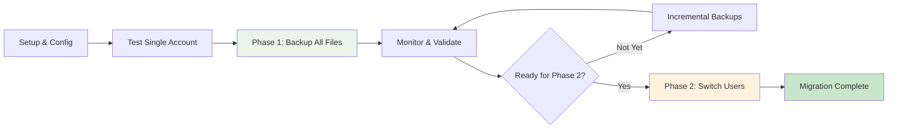

# Two-Phase Salesforce File Migration System

## 📋 Documentation Index

This comprehensive migration system safely transfers 1M+ files from external S3 storage to your own S3 bucket with zero user disruption during the backup phase.

### 📖 Core Documentation
| Document | Purpose | Audience |
|----------|---------|----------|
| **[DOCUMENTATION.md](DOCUMENTATION.md)** | Complete system documentation with architecture diagrams | Technical teams, architects |
| **[QUICK_REFERENCE.md](QUICK_REFERENCE.md)** | Essential commands and troubleshooting | Daily operators, support teams |
| **[VISUAL_WORKFLOWS.md](VISUAL_WORKFLOWS.md)** | Process flows and decision trees | All stakeholders |
| **[DEPLOYMENT_CHECKLIST.md](DEPLOYMENT_CHECKLIST.md)** | Step-by-step deployment guide | Project managers, deployment teams |

### ⚙️ Technical Reference
| Document | Purpose |
|----------|---------|
| **[CLAUDE.md](CLAUDE.md)** | Technical reference for future development |
| **[TWO_PHASE_MIGRATION_GUIDE.md](TWO_PHASE_MIGRATION_GUIDE.md)** | Original detailed migration guide |

## 🚀 Quick Start

### 1. Setup
```bash
pip install -r requirements.txt
cp config_template.py config.py
# Edit config.py with your credentials
```

### 2. Test Configuration
```bash
python list_accounts.py
```

### 3. Start Phase 1 (Safe Backup)
```bash
python backup_only_migration.py --full
```

### 4. Monitor Progress
```bash
python migration_status.py --overview
```

### 5. When Ready - Execute Phase 2
```bash
python full_migration.py --dry-run    # Test first
python full_migration.py --execute    # Go live
```

## 🎯 System Overview

### Two-Phase Approach Benefits
- **Phase 1**: Creates complete backup with zero user impact
- **Phase 2**: Seamless switchover when you're ready
- **Scalable**: Handles 1M+ files efficiently with SQLite tracking
- **Safe**: Comprehensive rollback capabilities

### Architecture Diagram
```
External S3 ──────┐
(trackland)       │
                  ▼
              Migration
               System  ──────► Your S3 Bucket
                  │            (organized)
                  ▼
              SQLite DB
              (tracking)
                  │
                  ▼
             Salesforce
           (DocListEntry__c)
```

## 📊 Key Features

### ✅ Safety Features
- **Zero downtime** during Phase 1 backup
- **Comprehensive rollback** with automatic rollback data
- **Error isolation** - individual failures don't stop migration  
- **Dry run modes** for all operations
- **Complete audit trail** in SQLite database

### ⚡ Performance Features  
- **Batch processing** optimized for large datasets
- **Incremental backups** for ongoing file additions
- **SQLite database** for efficient 1M+ record tracking
- **Memory optimization** for long-running processes
- **Parallel processing** where applicable

### 🔍 Monitoring Features
- **Real-time progress** tracking and statistics
- **Comprehensive error** logging and analysis
- **Account-level** breakdowns and reporting
- **Performance metrics** and trend analysis
- **Export capabilities** for detailed reports

## 🛠️ Core Scripts

| Script | Purpose | When to Use |
|--------|---------|-------------|
| `backup_only_migration.py` | Phase 1: Safe backup without Salesforce changes | Start here - safe for production |
| `full_migration.py` | Phase 2: Complete migration with URL updates | When ready to switch users |
| `migration_status.py` | Monitor progress and get statistics | Ongoing monitoring |
| `rollback_migration.py` | Emergency recovery system | If Phase 2 fails |
| `list_accounts.py` | Discover accounts with files | Initial analysis |
| `migration_analysis.py` | Comprehensive scope analysis | Planning and sizing |

## 📈 Migration Process Flow



## 🔧 Configuration Examples

### Testing Configuration
```python
MIGRATION_CONFIG = {
    "test_single_account": True,
    "test_account_id": "0013D00000AbcDef",
    "max_test_files": 5,
    "dry_run": True,
    "batch_size": 10
}
```

### Production Configuration
```python
MIGRATION_CONFIG = {
    "test_single_account": False,
    "dry_run": False,
    "batch_size": 100,
    "max_file_size_mb": 100,
    "allowed_extensions": ['.pdf', '.doc', '.docx', '.xlsx']
}
```

## 📋 Database Schema Overview

The system uses SQLite to track migration state:

- **`file_migrations`**: Core file tracking with metadata
- **`migration_runs`**: History of backup and migration runs  
- **`migration_errors`**: Detailed error tracking and analysis

Key fields: `doclist_entry_id`, `original_url`, `your_s3_url`, `salesforce_updated`

## 🆘 Emergency Procedures

### If Issues During Phase 1
```bash
# Check status and errors
python migration_status.py --recent-errors 10

# Resume backup process
python backup_only_migration.py --incremental
```

### If Issues During Phase 2
```bash
# Immediate rollback to safety
python rollback_migration.py --from-database --execute

# Verify users are back on external S3
python migration_status.py --overview
```

## 📞 Support & Troubleshooting

### Quick Diagnostics
1. **Check logs**: `logs/` directory for detailed errors
2. **Check status**: `python migration_status.py --all`
3. **Verify config**: Ensure credentials in `config.py` are correct
4. **Test connectivity**: Run `python list_accounts.py`

### Common Solutions
| Issue | Quick Fix |
|-------|-----------|
| Auth failed | Check credentials and security token |
| AWS access denied | Run `aws configure` or check IAM permissions |
| Database locked | Check for other running migration processes |
| Slow performance | Reduce `batch_size` in configuration |

## 🎯 Success Criteria

### Phase 1 Success
- ✅ > 95% file backup success rate
- ✅ Zero user complaints or access issues  
- ✅ Database tracking complete and consistent
- ✅ Performance within acceptable ranges

### Phase 2 Success
- ✅ > 95% Salesforce URL update success rate
- ✅ Users can access files from your S3 seamlessly
- ✅ Performance equal or better than before
- ✅ Rollback data successfully generated

## 🔒 Security Considerations

- **Credential protection**: `config.py` is git-ignored
- **Data encryption**: S3 encryption recommended
- **Access control**: Least-privilege IAM policies
- **Audit trail**: Complete migration history in database
- **Rollback capability**: Original URLs preserved for recovery

---

## 📚 Where to Start

1. **New to the system?** Start with [DOCUMENTATION.md](DOCUMENTATION.md)
2. **Ready to deploy?** Follow [DEPLOYMENT_CHECKLIST.md](DEPLOYMENT_CHECKLIST.md)  
3. **Daily operations?** Keep [QUICK_REFERENCE.md](QUICK_REFERENCE.md) handy
4. **Understanding flows?** Review [VISUAL_WORKFLOWS.md](VISUAL_WORKFLOWS.md)

**Remember**: Phase 1 is completely safe - it creates backups without affecting users. Start there and take your time before moving to Phase 2.

---

*This system has been designed to safely handle enterprise-scale migrations with comprehensive safety nets and monitoring capabilities.*