# Visual Workflow Diagrams

## Migration Decision Tree

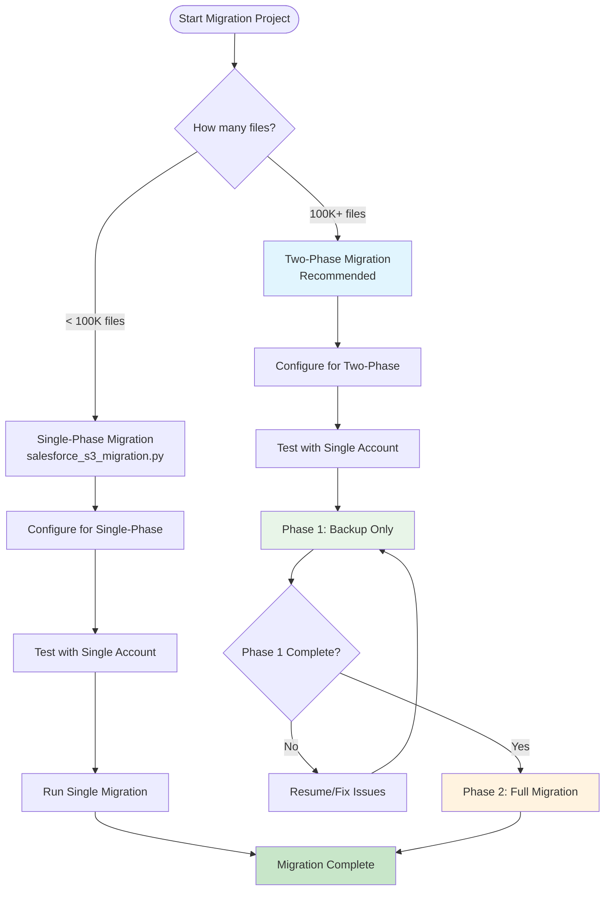

## Two-Phase Migration Workflow

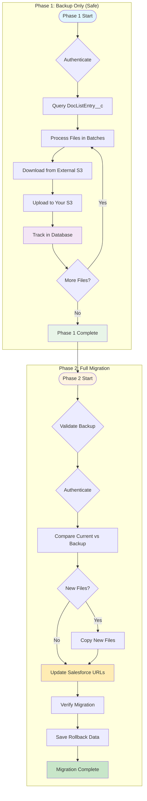

## System State Transitions

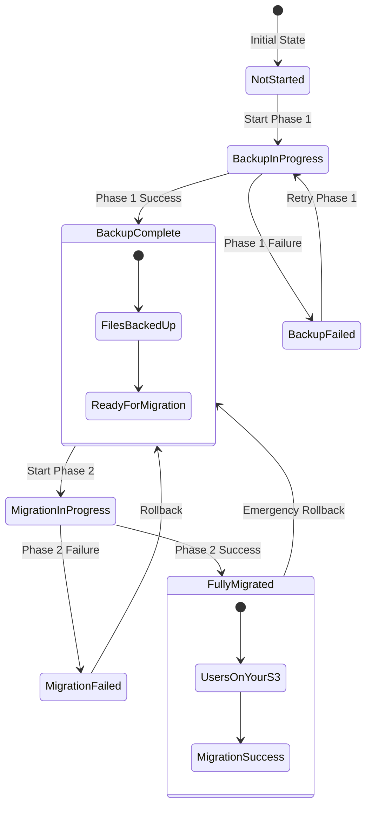

## User Impact During Migration

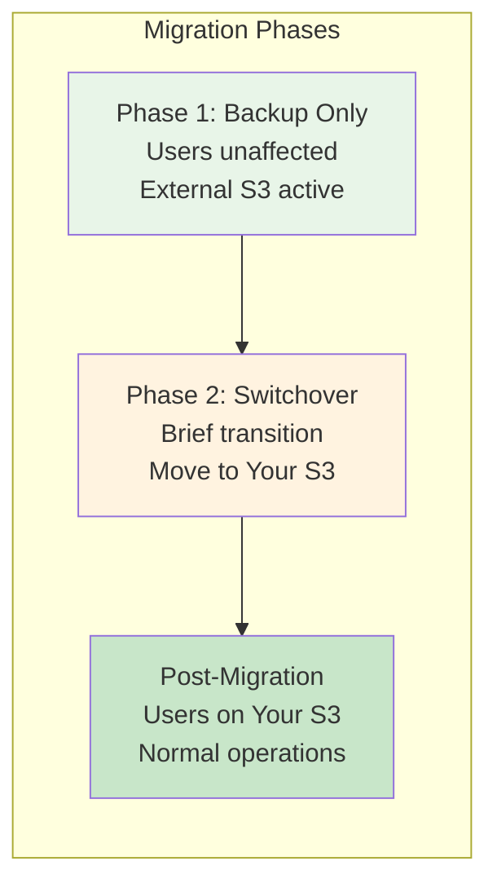

## Error Handling Flow

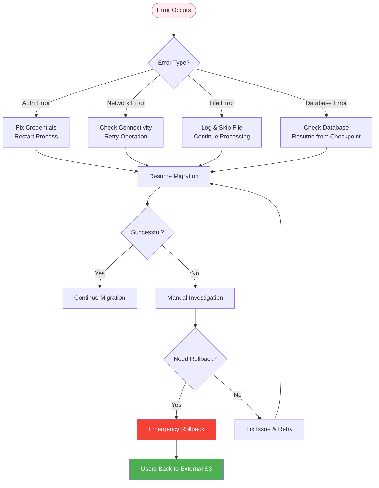

## Database Growth Pattern

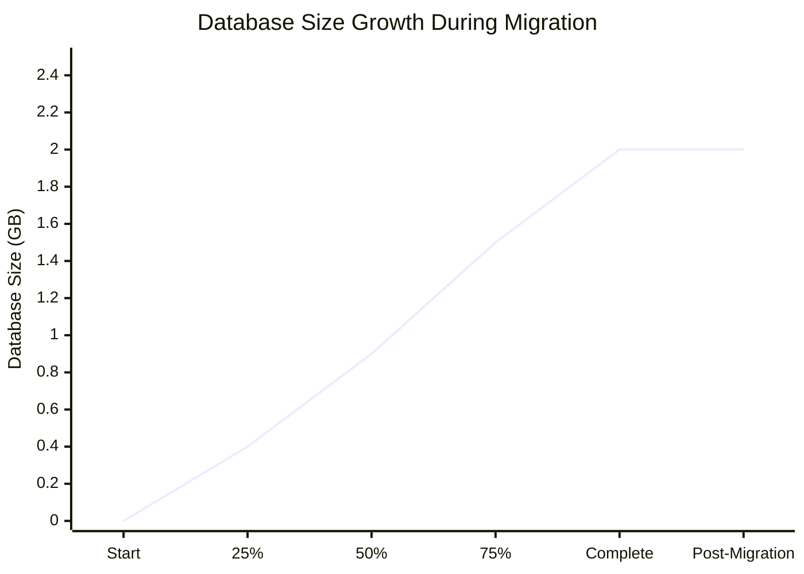

## Performance Monitoring Dashboard

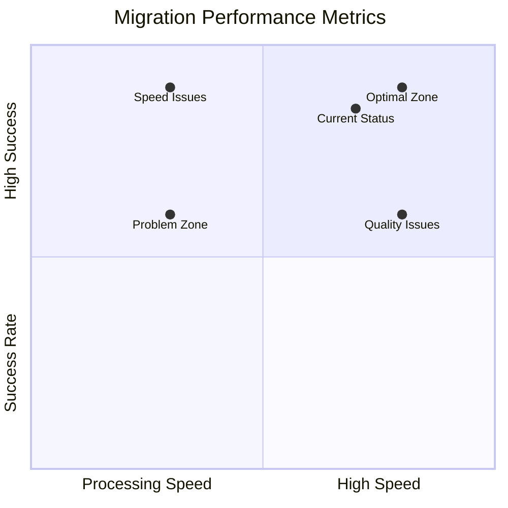

## Batch Processing Flow

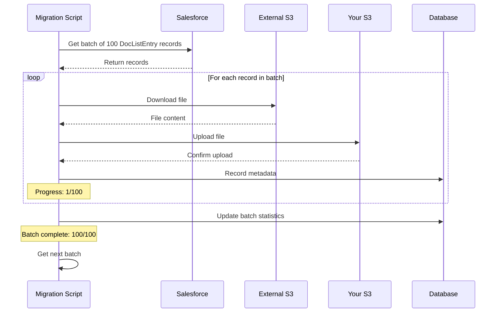

## Rollback Decision Tree

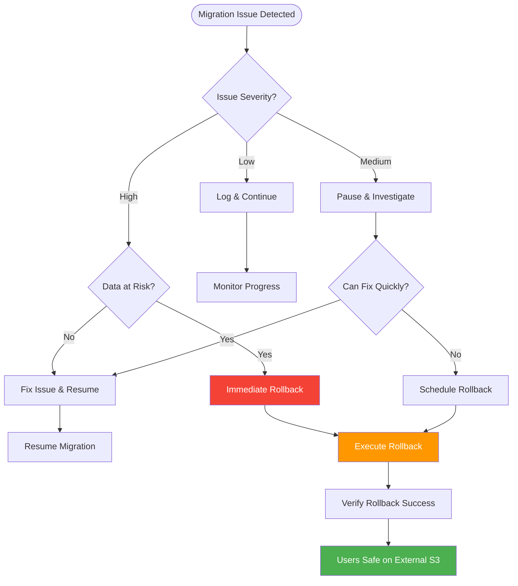

## S3 File Organization Structure

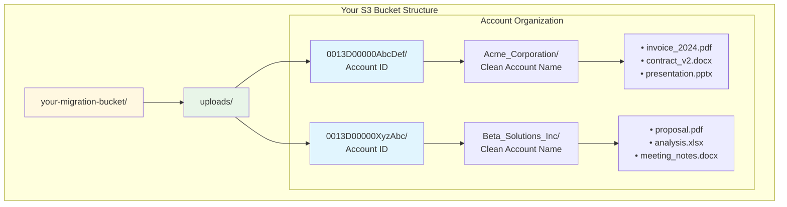

## Migration Phases Overview

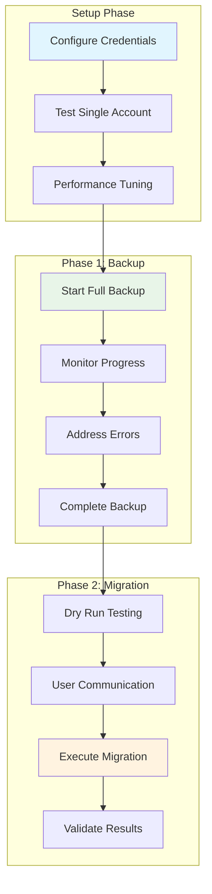

---

*These visual workflows provide quick understanding of the migration process flow, decision points, and system states throughout the migration lifecycle.*